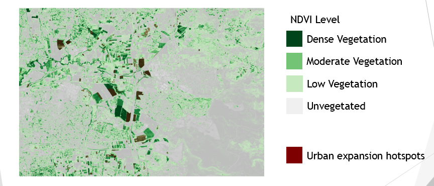
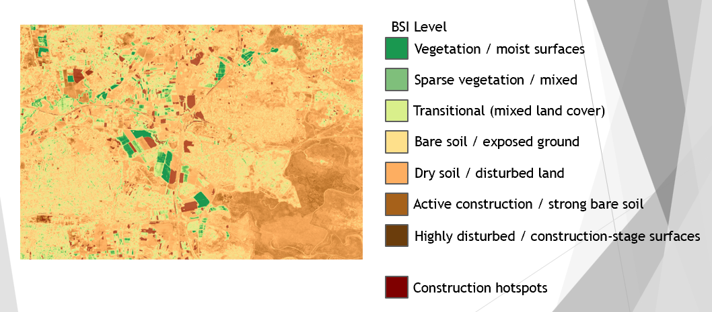
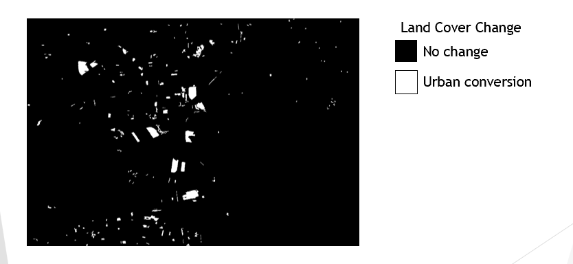

# Sentinel-2 Urban Expansion Detection in Petah Tikva (2018–2025)

This project analyzes urban expansion on the southeastern fringe of Petah Tikva, Israel, using Sentinel-2 satellite imagery, Google Earth Engine, and Python. It detects vegetation-to-built land conversion, identifies spatial hotspots, and quantifies land-use change over time.

---

## 📍 Project Overview

Rapid urban growth in the Gush Dan region is placing increasing pressure on natural land and infrastructure. This project develops an end-to-end geospatial workflow to:

- Detect vegetation loss and built-up expansion
- Identify urban conversion hotspots
- Quantify spatial land-use change between 2018 and 2025

---

## 🛰️ Data

- **Source:** Sentinel-2 Surface Reflectance (ESA)
- **Years:** 2018, 2021, 2023, 2025
- **Spatial resolution:** 10 m

### Spectral Bands
- B2 (Blue), B3 (Green), B4 (Red)  
- B8 (NIR), B11 (SWIR1), B12 (SWIR2)

### Derived Indices
- **NDVI** – vegetation  
- **NDBI** – built-up areas  
- **BSI** – bare soil / construction  

---

## ⚙️ Methodology

### 1. Preprocessing (Google Earth Engine)
- Cloud masking (QA60)
- Seasonal composites (May–July)
- Spectral index calculation (NDVI, NDBI, BSI)
- Export to GeoTIFF

### 2. Change Detection (Python)
- Multi-temporal differencing (2018–2025)
- Rule-based classification:
  - NDVI decrease  
  - NDBI increase  
  - BSI increase  
- Binary conversion mask generation

### 3. Post-processing
- Speckle removal using raster filtering
- Polygon extraction of hotspots
- Area calculation (hectares)

---

## 📊 Key Results

- **Mean ΔNDVI:** −0.46 (vegetation decline)  
- **Mean ΔNDBI:** +0.29 (built-up increase)  
- **Mean ΔBSI:** +0.27 (bare soil / construction increase)  
- Clear spatial clustering of urban expansion  
- Dominant growth direction: **southeastern urban fringe**

---

## 🗺️ Visual Outputs

### NDVI Change and Hotspots

### BSI Construction Areas

### Conversion Mask

---

## 📁 Project Structure

petah-tikva-urban-expansion-sentinel2/
│
├── data/
│ ├── PetahTikva_S2_2018.tif
│ ├── PetahTikva_S2_2021.tif
│ ├── PetahTikva_S2_2023.tif
│ └── PetahTikva_S2_2025.tif
│
├── scripts/
│ ├── gee_petah_tikva_preprocessing.js
│ ├── main.py
│ └── requirements.txt
│
├── outputs/
│ ├── conversion_2018_2025.tif
│ ├── construction_2018_2025.tif
│ └── conversion_hotspots.geojson
│
├── figures/
│ ├── ndvi_2018.png
│ ├── ndvi_2025.png
│ ├── ndvi2018_hotspots_overlay.png
│ ├── bsi2025_construction_overlay.png
│ ├── conversion_mask.png
│ ├── hist_ndvi.png
│ ├── hist_ndbi.png
│ └── hist_bsi.png
│
├── docs/
│ ├── project_poster.pdf
│ ├── project_poster.jpg
│ └── report.pdf
│
└── README.md

---

## 🧠 Skills Demonstrated

- Remote sensing (Sentinel-2)
- Spectral index analysis (NDVI, NDBI, BSI)
- Google Earth Engine workflows
- Python geospatial processing (rasterio, NumPy, GeoPandas)
- Change detection modeling
- Spatial data interpretation

---

## 🚀 How to Run

### 1. Install dependencies

pip install -r scripts/requirements.txt

### 2. Run analysis

python scripts/main.py

---

## 📄 Additional Resources

- 📊 Poster: `docs/project_poster.pdf`
- 📘 Full report: `docs/report.pdf`

---

## 📬 Contact

Benjamin Klass  
Geospatial Data Analyst  

📧 klassbenjamin@gmail.com  
🔗 https://www.linkedin.com/in/benjamin-klass/  

---

## ⚡ Notes

- Raw Sentinel-2 data is included for reproducibility  
- GEE script (`.js`) contains full preprocessing pipeline  
- Workflow demonstrates end-to-end satellite → insight pipeline  

<<<<<<< HEAD
---
=======
---
>>>>>>> 7680b7266bfbb8236b80ee782e498dc48e4bfc8d
